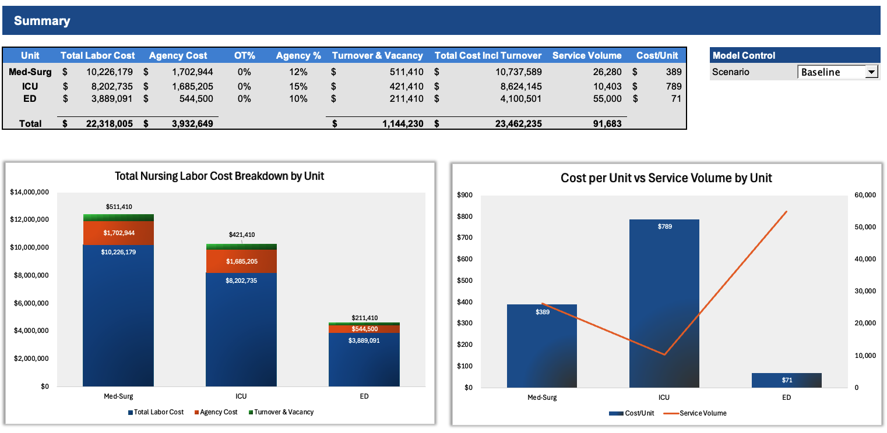
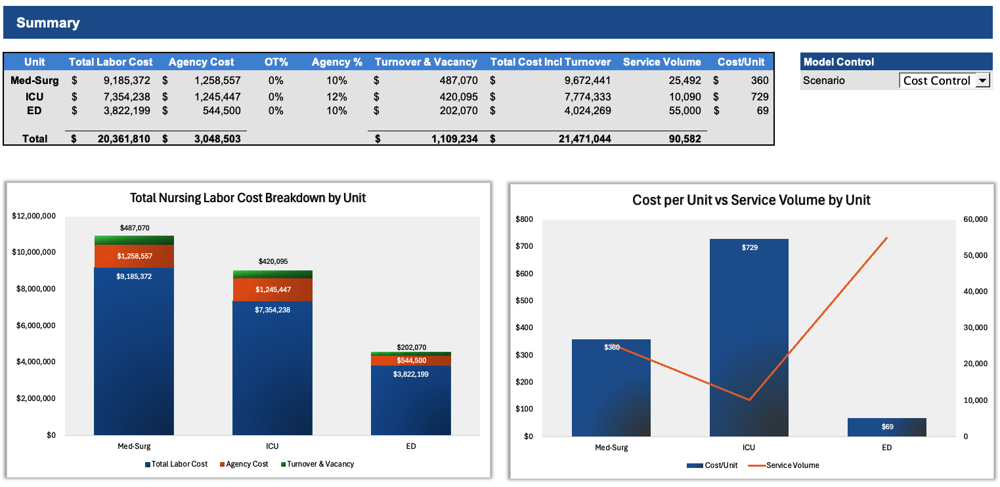
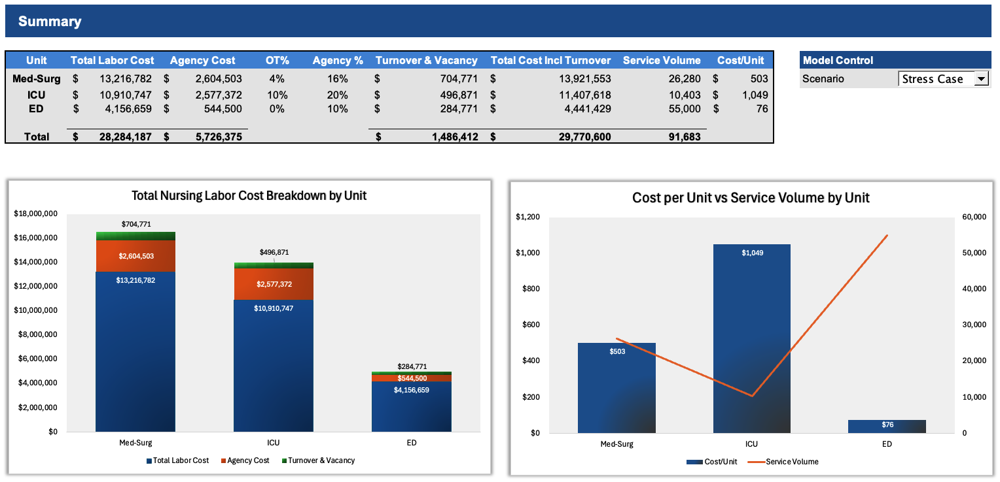

# Multi-Unit Nursing Salary Model (Med-Surg | ICU | ED)

A scenario-driven nursing labor planning model that translates patient demand into required RN hours, staffing capacity, and total labor cost across **Med-Surg, ICU, and Emergency Department**. The model highlights key cost drivers—including **agency utilization, overtime pressure, and turnover/vacancy economics**—and rolls unit-level calculations into an executive-ready **Summary dashboard**.

---

## What This Model Answers?

- **Where is total nursing labor cost concentrated (by unit)?**
- **How much of labor spend is driven by agency vs core staff vs turnover/vacancy?**
- **Which unit is most expensive per service unit—and why?**
- **How do costs and staffing risks change under different scenarios?**

---

## 🧠 Executive Summary

This project is a **scenario-driven nursing labor cost model** designed to help healthcare leaders understand how operational decisions translate into staffing demand, labor mix, and total cost across **Med-Surg, ICU, and Emergency Department (ED)** units.

The model converts **patient demand (beds, occupancy, ED visits)** into **required RN hours**, allocates those hours across **core staff, agency, and overtime**, and incorporates the **full economic impact of turnover and vacancy coverage**. Unit-level calculations are rolled into an executive Summary dashboard that allows leadership to evaluate trade-offs between **cost control, quality investment, and operational stress** in real time.

Rather than focusing only on wages, the model highlights how **staffing intensity, agency reliance, and retention dynamics** materially change labor cost—often more than hourly pay alone. This framework mirrors how nursing labor decisions are evaluated in real hospital finance and operations settings.

---

## 🔍 Key Findings & Insights

### 💰 1. Med-Surg is the Primary Cost Driver — by Scale, Not Inefficiency
Across all scenarios, **Med-Surg accounts for the largest share of total nursing labor cost**, driven by high patient volume rather than unusually high cost per unit. Small changes in staffing ratios or agency utilization in Med-Surg produce **outsized financial impact**, making it the most leverageable unit for cost management initiatives.

---

### 🏥 2. ICU Cost per Unit Is Structurally High — and Largely Non-Negotiable
The ICU consistently exhibits the **highest cost per service unit**, reflecting higher staffing intensity, acuity, and limited flexibility in nurse-to-patient ratios. Cost control strategies in ICU are therefore more constrained and must prioritize **retention and agency management** rather than pure staffing reductions.

---

### 🚑 3. ED Is Volume-Driven — Low Cost per Visit, High Sensitivity
The ED shows the **lowest cost per visit**, but the **highest service volume**, making it extremely sensitive to demand fluctuations. Even modest increases in ED volume or RN hours per visit can materially increase total labor cost, despite appearing “efficient” on a per-unit basis.

---

### 🔄 4. Agency Reduction Shifts Pressure — It Does Not Eliminate Cost
Scenarios that reduce agency utilization successfully lower premium labor spend, but often **shift pressure to core staff capacity**, increasing exposure to overtime or turnover risk if staffing levels are not adjusted concurrently. The model demonstrates that **agency reduction without capacity planning is not cost-free**.

---

### 🧩 5. Turnover & Vacancy Costs Are a Hidden, Material Expense
Turnover and vacancy coverage costs represent a **non-trivial portion of total labor expense**, particularly in stress scenarios. Improving retention produces meaningful savings by reducing replacement cost **and** the downstream need for agency or overtime coverage—an insight often missed in wage-only analyses.

---

### ⚖️ 6. Cost Control vs Quality Investment Is a Trade-Off — Not a Binary Choice
The scenario framework illustrates that:
- **Cost control** strategies reduce total spend but may increase staffing pressure
- **Quality investment** strategies raise labor cost while improving staffing intensity and reducing turnover
- **Stress scenarios** reveal how quickly costs escalate when wage pressure, agency reliance, and turnover move together

This reinforces that nursing labor decisions require **balanced, system-level thinking**, not isolated cost cuts.

---

## Dashboard Preview (Summary Tab)

The **Summary** tab is designed as an executive view with:
- Unit-level rollup table (Total Labor Cost, Agency $, OT%, Turnover/Vacancy $, Cost/Unit, Volume)
- Stacked cost breakdown chart by unit
- Combo chart (Cost/Unit vs Service Volume)

## 📊 Dashboard Preview (Summary Tab)

### Baseline

### Cost Control

### Quality Investment

### Stress Case

---

## Model Architecture (How it’s built)

This model follows a professional structure used in healthcare finance:

### 1) **Assumptions / Scenarios (Inputs Engine)**
A centralized assumptions area stores:
- Pay assumptions (base wage, OT multiplier, benefits load, shift differential, agency rate)
- Turnover & vacancy assumptions (replacement cost, vacancy duration, coverage mix)
- Unit operational assumptions (beds, occupancy, nurse-to-patient ratios, ED visits, RN hours per ED visit)
- Scenario multipliers (wage, volume/occupancy, staffing ratio, agency %, turnover)

### 2) **Unit Detail Tabs (Calculation Engine)**
Each unit has a dedicated detailed calculation block that:
- Converts demand → **required RN hours**
- Splits hours into **core vs agency vs OT**
- Converts hours → **wage cost + benefits**
- Adds **turnover/vacancy cost** using effective turnover + vacancy coverage logic
- Produces clean outputs for rollup

### 3) **Summary Tab (Executive Rollup)**
The Summary tab contains **no heavy calculations**—it pulls results from each unit and presents:
- Side-by-side unit performance
- Visuals that update instantly when the scenario changes

This structure keeps the dashboard stable, auditable, and easy to explain in interviews.

---

## Scenarios (Model Control)

The scenario dropdown updates all units simultaneously using multipliers:

| Scenario | Wage | Volume/Occupancy | Staffing Ratio | Agency % | Turnover |
|---|---:|---:|---:|---:|---:|
| **Baseline** | 1.00 | 1.00 | 1.00 | 1.00 | 1.00 |
| **Cost Control** | ↓ | ↓ | (operational constraint) | ↓ | ↓ |
| **Quality Investment** | ↑ | ↑ | (more staffing intensity) | ↓ | ↓ |
| **Stress Case** | ↑ | ~ | (staffing pressure) | ↑ | ↑ |

**Interpretation notes**
- **Wage multiplier**: applies to base RN hourly wage
- **Volume/Occupancy multiplier**: scales patient days (inpatient) or ED visits
- **Staffing ratio multiplier**: increases/decreases nursing intensity (RN hours per unit demand)
- **Agency % multiplier**: increases/decreases share of hours covered by agency
- **Turnover multiplier**: increases/decreases turnover/vacancy burden and related cost

---

## Core Method (High-level logic)

### Inpatient Units (Med-Surg, ICU)
1. **Patient Days / Year** = Beds × Occupancy × 365 (scenario-adjusted)
2. **Required RN Hours** = Patient Days × HPPD (scenario-adjusted via staffing ratio)
3. **Agency Hours** = Required Hours × Agency %
4. **Core Hours** = Required Hours − Agency Hours
5. **OT Hours** activates only if **Core Hours > Core Regular Capacity**
   - Regular capacity = Core RN FTE × Productive Hours/FTE
   - OT Hours = MAX(0, Core Hours − Regular capacity)

### ED Unit
1. **Required RN Hours** = ED Visits × RN hours per ED visit (scenario-adjusted)
2. Split into agency/core/OT using the same mechanics

### Cost Build
- **Regular wage cost** = Regular hours × base rate × (1 + differential add-on)
- **OT wage cost** = OT hours × OT rate
- **Agency cost** = Agency hours × agency rate
- **Benefits** apply to **employee wages only** (Regular + OT), not agency  
- **Turnover/Vacancy cost** includes replacement cost + vacancy coverage economics

---

## Assumptions (Editable Inputs)

Key inputs are editable in the assumptions section:
- Base RN hourly wage, agency rate, benefits %, OT multiplier, shift differential
- Turnover rate, replacement cost per RN, vacancy weeks per hire, vacancy coverage mix
- Unit operational drivers (beds, occupancy, ratios, ED visits, RN hours per ED visit)

## 🎯 Why This Model Matters

This model is designed to support:
- **Healthcare finance teams** evaluating labor budgets
- **Operations leaders** assessing staffing sustainability
- **Strategic planning** discussions around cost, quality, and workforce stability

By integrating demand, staffing, and labor economics into one framework, the model enables more **transparent, defensible, and data-driven decisions** around one of the largest cost centers in healthcare.

